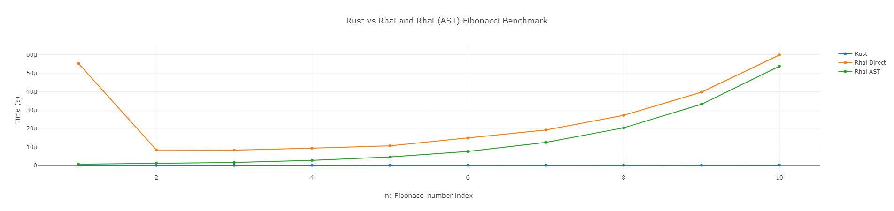
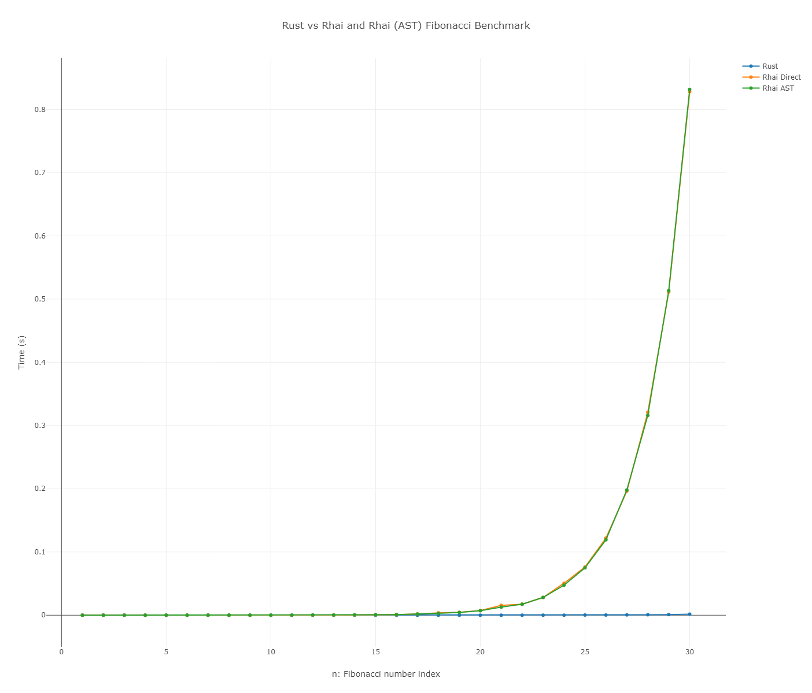

## モチベーション

最近 [Rhai](https://rhai.rs/) という Rust で動作するスクリプトエンジンを見つけました。

ゲーム開発向けにライブラリの作成を検討していて、当初は目的のライブラリそのものを Cython(Python)で作成しようと考えていたものの、モバイル向けにポーティングするには numpy などのパッケージ導入のハードルが高いことがわかり、断念していました。

最終的に Rust を使うことに決めたのですが、スクリプトエンジンがあるとは知らなかったので嬉しい誤算です。

また、Rhai は AST(abstract syntax tree) というコードをパースした結果を Rust で取得することができます。これを再利用することでパースの時間を省略し、高速にスクリプトを実行できるという利点があります。

そこで、当然ながらどれほどの速度差があるのか気になりましたので、ベンチマークを取ってみました。

## 結果

テストコードおよび結果はこちらのリポジトリにあります。  
[Benchmark Rust Rhai](https://github.com/Nagitch/benchmark-rust-rhai)

フィボナッチ数列を n 回計算するという単純な処理を行い、その時間を計測しました。
主要な部分の抜粋は以下。

```rust
    let engine = Engine::new();
    let script = "
        fn fibonacci(n) {
            if n <= 1 { return n; }
            else { return fibonacci(n-1) + fibonacci(n-2); }
        }
        fibonacci(n)
    ";
    let mut rust_times = Vec::new();
    let mut direct_times = Vec::new();
    let mut ast_times = Vec::new();
    let mut ns = Vec::new();

    for n in 1i64..=10i64 {
        ns.push(n);
        let mut scope = Scope::new();
        scope.push("n", n);

        // Rust (vanilla)
        let start = Instant::now();
        let _rust_result = fibonacci(n as i64);
        let rust_duration = start.elapsed().as_secs_f64();
        rust_times.push(rust_duration);

        // Rhai (direct)
        let start = Instant::now();
        let _direct_result: i64 = engine.eval_with_scope(&mut scope, script)?;
        let direct_duration = start.elapsed().as_secs_f64();
        direct_times.push(direct_duration);

        // Rhai (AST)
        let ast = engine.compile_with_scope(&mut scope, script)?;
        let start = Instant::now();
        let _ast_result: i64 = engine.eval_ast_with_scope(&mut scope, &ast)?;
        let ast_duration = start.elapsed().as_secs_f64();
        ast_times.push(ast_duration);
    }
```

私が docker-compose で走らせた結果は以下の通りでした。

n=10


n=30


## 考察

前提として、当然ながら PC のスペックによって処理時間は変わるため、Rust(=Vanilla)をベースに相対的な速度を比較して評価します。
結果としては以下のことが考察できます。

- 無論、Rust が最速である
- Rhai(Direct)の初回の実行が遅い
  - これはスクリプトエンジンの初回の evaluate に時間がかかるためと思われる（面倒なので未検証）
- Rhai(AST) は Rhai(direct)より早い。スクリプトが複雑になるほど恩恵があると予想できる
- イテレーションが進むにつれて、Rust と Rhai(Direct, AST) の差が指数関数的に広がっていく
  - ごく一般的な話ではあるが、スクリプトで行う処理は短いほうが良い。特に反復的な処理。
- イテレーション 30 で Rhai(Direct, AST) が 830ms 程度に対して、Rust が約 1.5ms （出力した HTML だとポイントごとのデータが見れる）だった。
  - 1/500 程度の差がある(=Rust が 500 倍速い)ということになる。アプリケーションで Rhai がボトルネックになっていると特定できた場合、500 倍の速度向上が見込めると予想できる。

## 所感

スクリプトエンジンを搭載する利点は JS, Python よろしくランタイムでプログラミングできることです。

Rhai ではこの柔軟性を持ちながら、もしボトルネックになるような処理があれば Rust で書き直すことで高速化が見込めるという利点があります。

今まででも、例えば Python と Cython, C++の組み合わせにより同等のことは可能ではありますが、スムーズさや移植性の点で Rust と Rhai の組み合わせは魅力的だと感じました。

また、AST を取得することでスクリプトのパース時間を省略できる機能もなるほどという感じです。これはスクリプトが複雑になるほど恩恵があると予想されるため、ぜひ活用したいと思いました。

まだまだ研究中ですが、開発全般のワークフローを効率化できる余地がありそうです。
何かと機会があれば実際のアプリ開発に取り入れてみたいと思っています。

## 更新履歴

- 2023-07-06: 初稿
